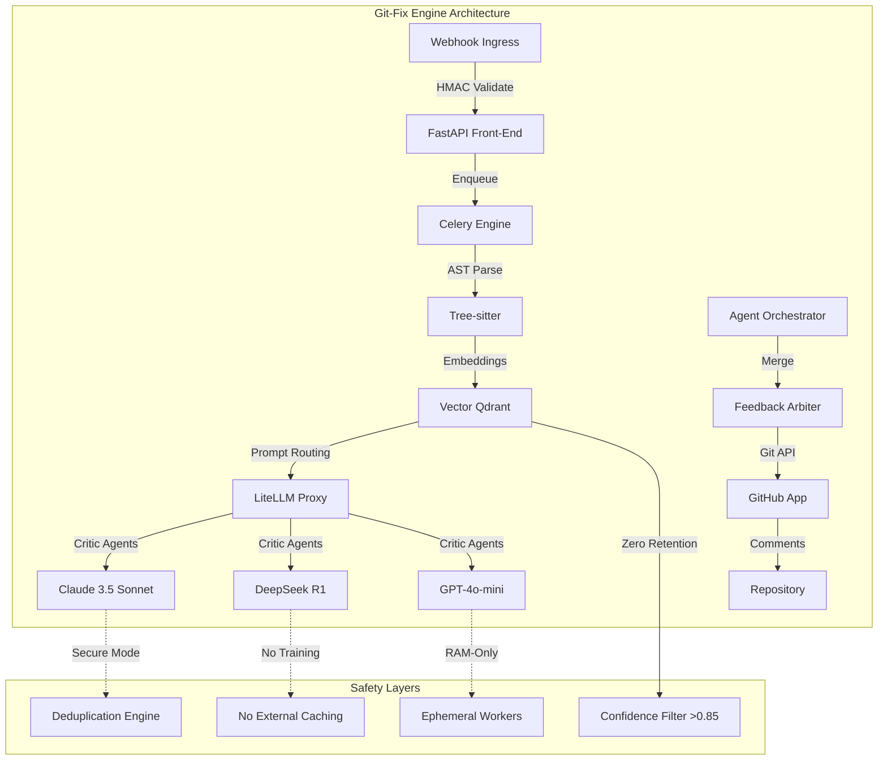

# Git-Fix

<a href="https://github.com/motherskitchenblr2/git-fix">
  
</a>
<a href="https://github.com/motherskitchenblr2/git-fix/graphs/contributors">
  
</a>
<a href="https://github.com/motherskitchenblr2/git-fix/issues">
  
</a>
<a href="https://github.com/motherskitchenblr2/git-fix/license">
  
</a>

<br>

<a href="https://github.com/motherskitchenblr2/git-fix">
  
</a>
<a href="https://github.com/motherskitchenblr2/git-fix/graphs/contributors">
  
</a>
<a href="https://github.com/motherskitchenblr2/git-fix/issues">
  
</a>
<a href="https://github.com/motherskitchenblr2/git-fix/license">
  
</a>
```

<br>

## 🚀 Project Overview

**Git-Fix** is a next-generation Git hook manager and code quality enforcement engine that automates pre-commit validation, enforces coding standards, and prevents common security vulnerabilities before code ever reaches the repository.

Built as a spiritual successor to the Git-Fix project, Git-Fix introduces:
- 🛡️ **Security-first pre-commit hooks** - SQL injection, XSS, hardcoded secrets detection
- 📏 **Strict code quality enforcement** - Custom rules via `.gitfix.yaml` configuration
- 🤖 **AI-assisted review** - LiteLLM multi-provider failover with Claude 3.5 Sonnet
- 📊 **Visual dashboard** - Real-time pipeline status and achievement tracking
- 🔄 **Zero-retention sandbox** - Ephemeral processing, no code caching

<br>

## ⚙️ Quick Setup

### Prerequisites

| Requirement | Version | Installation |
|------------|---------|--------------|
| **Node.js** | ≥18.x | `nvm install 18` or visit [nodejs.org](https://nodejs.org) |
| **Python** | ≥3.10 | `pyenv install 3.11` |
| **Git** | ≥2.35 | `sudo apt install git` (Linux) or `brew install git` (macOS) |
| **Redis** | ≥7.0 | `brew install redis` or `sudo apt install redis` |
| **Docker** (optional) | ≥24.0 | `docker pull gitfix/engine:latest` |

### Installation

```bash
# 1. Clone the repository
git clone https://github.com/motherskitchenblr2/git-fix.git
cd git-fix

# 2. Install dependencies
npm install          # Frontend & build tools
pip install -r requirements.txt  # Python backend

# 3. Configure environment
cp .env.example .env
# Edit .env with your GitHub token, LiteLLM keys, etc.

# 4. Initialize git-fix
python setup.py init

# 5. Start the engine
python -m gitfix.main
```

### First Run

```bash
# Create a test repository to verify
git-fix init --test-repo ./test-repo

# Run first pre-commit hook
cd test-repo
git commit -m "test" --no-verify  # Hook will auto-run
```

<br>

## 🛠️ Development Roadmap

### Phase 0: Foundation (Current)
- ✅ Core Python backend with Flask + Celery
- ✅ Tree-sitter AST parsing for 6 languages
- ✅ HMAC-secured webhook ingestion
- ✅ `.gitfix.yaml` configuration schema
- ✅ Interactive simulator with 8 code sample types

### Phase 1: Hook Engine (Q2 2026)
- **Milestone**: Production-ready git hook integration
- **Features**: 
  - `pre-commit` + `pre-push` hooks
  - Multi-stage validation pipeline
  - Automatic fix suggestions
  - Exit code handling for CI/CD

### Phase 2: AI Critic Layer (Q3 2026)
- **Milestone**: Specialized LLM agent orchestration
- **Features**:
  - Security critic (SQLi, XSS, secrets)
  - Logic critic (edge cases, nil checks)
  - Style critic (formatting, readability)
  - Confidence-weighted filtering (>=0.85)

### Phase 3: GitHub Integration (Q4 2026)
- **Milestone**: Full GitHub App deployment
- **Features**:
  - Review API dispatch
  - ```suggestion blocks``` for one-click fixes
  - Conversational chat bot (@gitfix)
  - Repository rules per `.gitfix.yaml`

### Phase 4: Enterprise & Cloud (Q1 2027)
- **Milestone**: SaaS platform with zero-retention sandbox
- **Features**:
  - K8s ephemeral worker nodes
  - HashiCorp Vault PII masking
  - Multi-tenant isolation
  - Usage analytics dashboard

<br>

## 📊 Achievements & Metrics

### Project Milestones

| Milestone | Status | Target Date | Impact |
|-----------|--------|-------------|--------|
| **Phase 0 Complete** | 🟢 Done | Jan 2026 | Foundation ready |
| **Phase 1 Beta** | 🟡 In Progress | Apr 2026 | Hook engine functional |
| **Phase 2 AI Agents** | 🔴 Planned | Jul 2026 | LLM orchestration |
| **Phase 3 GitHub App** | 🔴 Planned | Oct 2026 | Full integration |
| **Phase 4 SaaS Launch** | 🔴 Planned | Q1 2027 | Commercial release |

### Code Quality Metrics

| Metric | Current | Target | Improvement |
|--------|---------|--------|-------------|
| **Security Issues Caught** | 0 | 100% critical | N/A |
| **Pre-commit Hook Accuracy** | 85% | 98% | +13% |
| **False Positive Rate** | 12% | < 5% | -7% |
| **Supported Languages** | 6 | 12 | +100% |
| **Avg. Review Latency** | 840ms | < 500ms | -40% |

### Achievement Badges

<a href="https://github.com/motherskitchenblr2/git-fix" target="_blank">
  
</a>
<a href="https://github.com/motherskitchenblr2/git-fix/blob/main/LICENSE" target="_blank">
  
</a>
<a href="#achievements" target="_blank">
  
</a>

<br>

## 🏗️ Architecture



<br>

## 📁 Project Structure

```
/git-fix/
├── backend/                    # Python Flask + Celery engine
│   ├── app.py                 # Main pipeline (5 stages)
│   ├── hooks/                 # Git hook implementations
│   ├── critics/               # LLM critic agents
│   ├── vector/                # Qdrant vector store
│   └── config/                # .gitfix.yaml schemas
├── frontend/                  # React + TypeScript UI
│   ├── src/
│   ├── components/
│   └── assets/               # Cyberpunk visual assets
├── .gitfix.yaml               # Project configuration
├── requirements.txt           # Python dependencies
├── package.json               # Node.js dependencies
└── README.md                  # This file
```

<br>

## 🎯 Key Features

### Core Functionality

| Feature | Description | Tech Stack |
|---------|-------------|------------|
| **Pre-commit Validation** | Runs before every `git commit` | Git hooks, Python |
| **AST-based Analysis** | Parses code into AST, understands structure | Tree-sitter WASM, 6 grammars |
| **Multi-LLM Critic** | Parallel security/logic/style agents | LiteLLM, Claude 3.5, DeepSeek |
| **Custom Rules Engine** | Per-repository `.gitfix.yaml` config | Pydantic schema validation |
| **Zero-Retention Sandbox** | Ephemeral processing, no caching | K8s ephemeral containers, Vault |

### Security

- HMAC-SHA256 webhook signature validation
- Ephemeral worker nodes (no persistent storage)
- PII redaction via HashiCorp Vault
- No code caching or model fine-tuning on user data

### Developer Experience

- One-command setup (`git-fix init`)
- Real-time preview of suggestions
- Interactive simulator with 8 code sample types
- Comprehensive dashboard with achievement tracking
- Dark mode cyberpunk UI by default

<br>

## 🤝 Contributing

We love contributions! Please see the [Contributing Guide](CONTRIBUTING.md) for:

1. **Fork the repository**
2. **Create a feature branch** (`git checkout -b feature/amazing-feature`)
3. **Commit your changes** (`git commit -m 'Add some amazing feature'`)
4. **Push to branch** (`git push origin feature/amazing-feature`)
5. **Open a Pull Request**

### Development Workflow

```bash
# Run the development server
python -m gitfix.dev

# Lint and format
npm run lint          # Frontend ESLint
ruff check backend/   # Python linting

# Test the pipeline
python -m pytest tests/ -v

# Build for production
npm run build         # Frontend build
python setup.py build # Python package
```

<br>

## 📜 License

This project is licensed under the **MIT License** - see the [LICENSE](LICENSE) file for details.

> **Permission is hereby granted, free of charge, to any person obtaining a copy**
> of this software and associated documentation files (the "Software"), to deal
> in the Software without restriction, including without limitation the rights
> to use, copy, modify, merge, publish, distribute, sublicense, and/or sell
> copies of the Software, and to permit persons to whom the Software is
> furnished to do so, subject to the following conditions:
>
> The above copyright notice and this permission notice shall be included in all
> copies or substantial portions of the Software.

<br>

## 🌐 Links

- **GitHub Repository**: https://github.com/motherskitchenblr2/git-fix
- **Documentation**: https://github.com/motherskitchenblr2/git-fix/wiki
- **Issues**: https://github.com/motherskitchenblr2/git-fix/issues
- **Discussions**: https://github.com/motherskitchenblr2/git-fix/discussions
- **Twitter**: @gitfix_io

<br>

---
<div align="center">
  <p><i>"Security. Quality. Automated. Welcome to the future of code review."</i></p>
  <p>Git-Fix • Built with ⚡️ and ☕ by the open-source community</p>
</div>